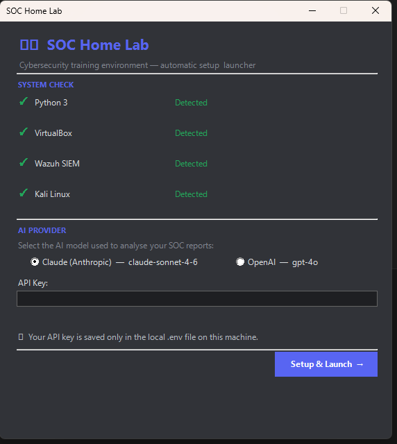
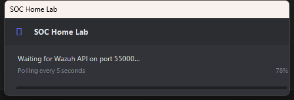
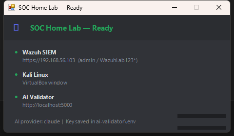
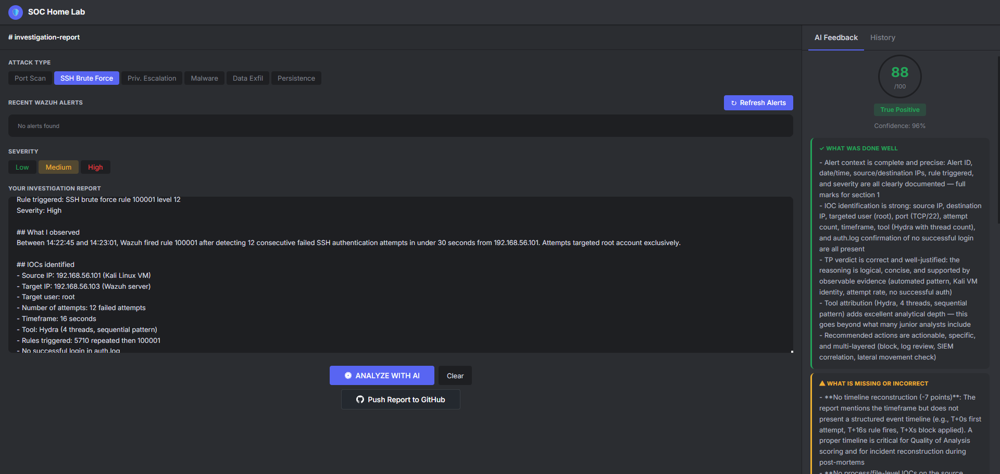

# SOC Home Lab

> Virtualized SOC environment with real-time intrusion detection, network IDS, and AI-powered investigation validation.
> Built on Windows 11 with VirtualBox — no cloud, no cost, runs entirely on your machine.

---

## Objective

Practice real SOC analyst workflows: detect attacks with Wazuh, investigate alerts, write investigation reports, and get instant AI feedback scored out of 100. Designed to build and demonstrate blue team skills for a junior analyst CV.

---

## Screenshots

<p align="center">
  <br><br>
  <em>Setup wizard — collects AI provider, API key, and confirms prerequisites before launching.</em>
</p>

<br>

<p align="center">
  <br><br>
  <em>Persistent progress window — tracks each step of VM startup and health checks.</em>
</p>

<br>

<p align="center">
  <br><br>
  <em>Confirmation dialog showing Wazuh, Kali, and AI Validator status before opening the browser.</em>
</p>

<br>

<p align="center">
  <br><br>
  <em>Real Wazuh alerts auto-imported and tagged NETWORK (Suricata) or HOST (OS/auth). Click any alert to pre-fill the report template.</em>
</p>

---

## Architecture

```
Windows 11 (host)
├── VirtualBox
│   ├── Wazuh v4.14.3 (SIEM — headless, no GUI)
│   │   ├── eth0 : 192.168.1.x     (bridge — home network)
│   │   └── eth1 : 192.168.56.x   (host-only — IP assigned by DHCP, detected automatically)
│   └── Kali Linux 2025.4 (attacker — GUI)
│       ├── Adapter 1 : host-only  (192.168.56.x)
│       └── Adapter 2 : NAT        (internet)
└── AI Validator (Flask — localhost:5000)
    ├── Wazuh REST API  → port 55000
    ├── OpenSearch      → SSH tunnel → port 9200  (real alerts)
    └── AI API          → Claude or OpenAI
```

The Wazuh host-only IP is read dynamically from `VBoxManage guestproperty` at each launch — no hardcoded IP required.

---

## Quick Start

**Prerequisites:** Windows 10/11, 16 GB RAM, ~15 GB free disk space.

```
1. Clone this repo
2. Double-click SOC-Home-Lab.exe  (or run SOC-Home-Lab.ps1 with pwsh)
3. Enter your AI API key when prompted
4. Click "Setup & Launch"
```

The wizard handles everything automatically:

- Installs Python and VirtualBox (via winget) if missing
- Downloads and imports the Wazuh OVA (~3.5 GB)
- Configures VM network adapters (host-only + bridge) and graphics controller
- Installs all Python dependencies
- Starts Wazuh headless and Kali with GUI
- Detects your Windows keyboard layout and applies it to Kali automatically
- Runs health checks and auto-repairs failed Wazuh services
- Opens the browser with Wazuh dashboard + AI Validator

### Compile to .exe (optional)

```powershell
.\compile.ps1
```

Requires PowerShell 7 and internet access (installs PS2EXE on first run). The resulting `SOC-Home-Lab.exe` can be double-clicked without any PowerShell window.

---

## Features

### Auto-import Wazuh alerts
Alerts load automatically when the validator opens — no manual import button. A silent background refresh runs every 30 seconds and updates the list without interrupting your report.

### NETWORK vs HOST alert tagging
Every alert is tagged at a glance:

| Badge | Meaning | Source |
|---|---|---|
| `NETWORK` (blue) | Detected by Suricata IDS on the network | rule 86601 / groups: ids, suricata |
| `HOST` (gray) | Detected by Wazuh agent on the OS | auth, syscheck, process, cron… |

### Severity color coding
Alert severity is shown as a left-border stripe and a pill badge:

| Level | Badge |
|---|---|
| 12+ | CRITICAL (red) |
| 8–11 | HIGH (orange) |
| 5–7 | MEDIUM (yellow) |
| < 5 | low (muted) |

### One-click report pre-fill
Click any alert in the list to instantly populate the report textarea with the alert's timestamp, source IP, agent name, rule description, and rule level — plus blank sections for your analysis.

### AI-scored investigation reports
Submit a report and get:
- A score out of 100
- True Positive / False Positive verdict
- Confidence rating
- Structured feedback: what was done well, what is missing, and exactly how to reach 100/100
- Full history of past reports

### Keyboard layout auto-detection
At launch, the wizard reads the Windows system locale (`Get-Culture`) and applies the corresponding X11 keyboard layout to Kali via SSH (`localectl set-x11-keymap`). Supports fr, de, es, it, pt, ru, and more — falls back to `us` if unrecognized.

### Consistent dark theme throughout
Both the web UI and all Windows Forms dialogs (wizard, progress, ready) share the same color palette:

| Role | Hex |
|---|---|
| Background | `#313338` |
| Surface | `#2B2D31` |
| Deep surface | `#1E1F22` |
| Accent | `#5865F2` |

---

## AI Provider

The validator supports two AI providers — choose during setup:

| Provider | Model | API Key |
|---|---|---|
| Claude (Anthropic) | claude-sonnet-4-6 | [console.anthropic.com](https://console.anthropic.com) |
| OpenAI | gpt-4o | [platform.openai.com](https://platform.openai.com/api-keys) |

Your API key is saved locally in `ai-validator/.env` only. It is never shared or transmitted anywhere other than the selected AI provider.

---

## Attack Scenarios

| Scenario | MITRE ATT&CK | Detection | Status |
|---|---|---|---|
| Network reconnaissance | T1046 | Suricata: SCAN nmap SYN | Tested |
| SSH brute force | T1110 | Wazuh rule 5712 (level 12) | Tested |
| User creation | T1136.001 | Wazuh rule 5902 | Tested |
| Data exfiltration | T1048 | Wazuh + Suricata | Tested |
| Persistence (crontab) | T1053.003 | Wazuh rule 5903 | Tested |
| Privilege escalation | T1548.003 | Wazuh rule 5402 | Tested |

Each scenario has a matching report template in the AI Validator (selectable via the Attack Type buttons). After running an attack from Kali, click an alert in the validator to pre-fill your report.

---

## AI Validator — Scoring Criteria

| Criteria | Points |
|---|---|
| Alert context (ID, date/time, IPs, rule triggered) | 10 |
| IOCs identified (IPs, ports, processes, hashes, files) | 20 |
| TP/FP verdict with clear justification | 25 |
| Analysis quality (timeline, correlation, reasoning) | 25 |
| Recommended action | 20 |

---

## Tech Stack

| Component | Tool | Version |
|---|---|---|
| SIEM | Wazuh | 4.14.3 |
| Attacker VM | Kali Linux | 2025.4 |
| Wazuh agent | wazuh-agent | 4.14.3 |
| Real alert source | OpenSearch via SSH tunnel | — |
| Network IDS | Suricata | 7.0.13 |
| AI Validator backend | Flask + Claude / OpenAI | Python 3.x |
| AI Validator frontend | Vanilla JS + CSS | — |
| Hypervisor | VirtualBox | 7.x |
| Launcher / setup | PowerShell 7 + Windows Forms | — |
| Distribution | PS2EXE (exe compilation) | — |

---

## Repository Structure

```
soc-home-lab/
├── SOC-Home-Lab.ps1        # Unified setup & launcher (main entry point)
├── compile.ps1             # Generates SOC-Home-Lab.exe via PS2EXE
├── config.ini              # Generated by the wizard (local, not committed)
├── docs/
│   └── screenshots/        # UI screenshots used in this README
│       ├── validator.png
│       ├── wizard.png
│       ├── progress.png
│       └── ready.png
└── ai-validator/
    ├── app.py              # Flask backend — Wazuh API + AI integration
    ├── health_check.py     # SSH health check & service repair for Wazuh
    ├── requirements.txt    # Python dependencies
    ├── .env.example        # Environment variable template
    ├── .env                # Your local config (not committed)
    ├── reports_history.json
    ├── static/
    │   ├── css/style.css   # Dark theme
    │   └── js/app.js       # Auto-import, silent refresh, NETWORK/HOST tagging
    └── templates/
        └── index.html
```

---

## Default Credentials

| Service | URL | Username | Password |
|---|---|---|---|
| Wazuh Dashboard | https://192.168.56.x | admin | WazuhLab123* |
| Wazuh REST API | https://192.168.56.x:55000 | wazuh | wazuh |
| Kali Linux | — | kali | kali |
| AI Validator | http://localhost:5000 | — | — |

The Wazuh IP (`192.168.56.x`) is assigned by the host-only DHCP server and detected automatically by the launcher. Check `config.ini` for the current value after first setup.

---

## License

MIT — free to use, fork, and adapt for learning purposes.
